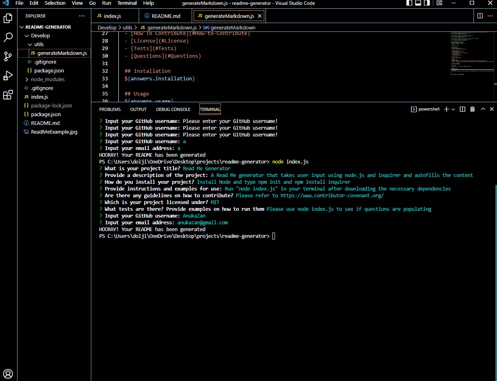

  
  # Read Me Generator

  ## Description
  A Read Me generator that takes user input using node.js and inquirer and autofills the content
  

  ## Table of contents
  - [Installation](#Installation)
  - [Usage](#Usage)
  - [How To Contribute](#How-to-Contribute)
  - [License](#License)
  - [Tests](#Tests)
  - [Questions](#Questions)

  ## Installation
  Install Node and type npm init and npm install inquirer

  ## Usage
  Run "node index.js" in your terminal after downloading the necessary dependencies
  [Watch the video](https://drive.google.com/file/d/1BU3mawMrZc_rwoywFP3lGs-4a46dxI0x/view)
  

  ## How to Contribute 
  Please refer to https://www.contributor-covenant.org/
  
  ## License
  This project is licensed under MIT

  ## Tests
  Please use node index.js to see if questions are populating

  ## Questions
  If you have any questions, please contact me at anukazan@gmail.com. You can view my projects at https://github.com/AnukaZan.
